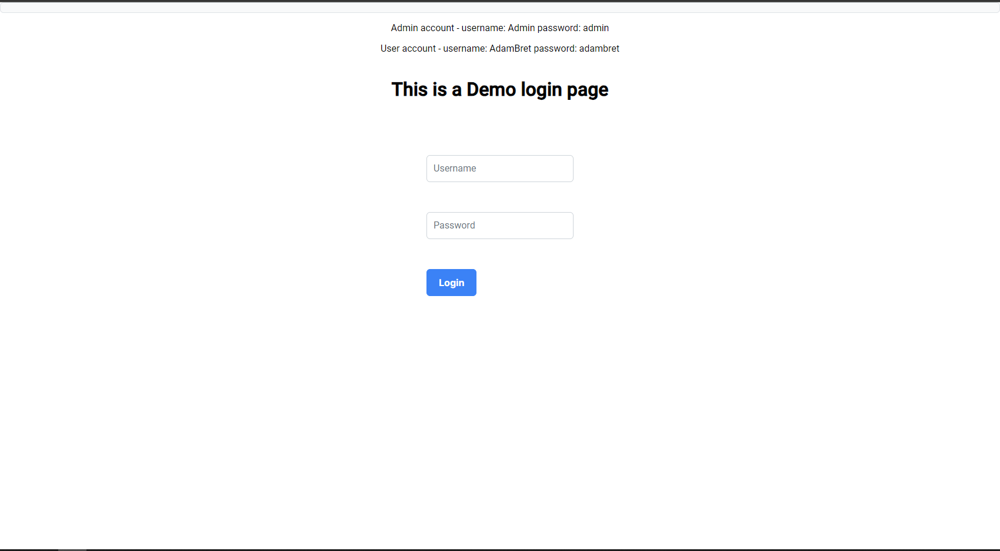

# Demo Login Page 
## Technologies
### Backend
* Java
* Spring Boot
### Frontend
* Angular
### Database
* Relational Database 
    - MySQL
### Authentication 
* Json Web Token
## Testing the page
### Backend
On the root directory of the backend folder run
```mvn spring-boot:run```
, application will be serve on localhost:8080
### Frontend
On the root directory of the frontend folder run
```ng serve```, application will be serve on localhost:4200
## Function 
Basic login page.


If user logged in with a wrong credential, page will bring up a toast to warn user that they are user a wrong credential.


Upon successful login with a **Admin role**, application will redirect to home page and display user details.
Admin dashboard button will only appear if user role is **Admin role** and when clicked it will redirect to admin page.
Login button will only appear if user is authenticated.


Admin page grant user with **Admin role** to access.


Upon successful login with a **user role**, page will redirect to home page and display user details.

_*Note that Admin Dashboard button is hidden, as user does not have the rights to access._

When user is not assign a **Admin role** but tries to access admin page, application will redirect them to a forbidden page.
